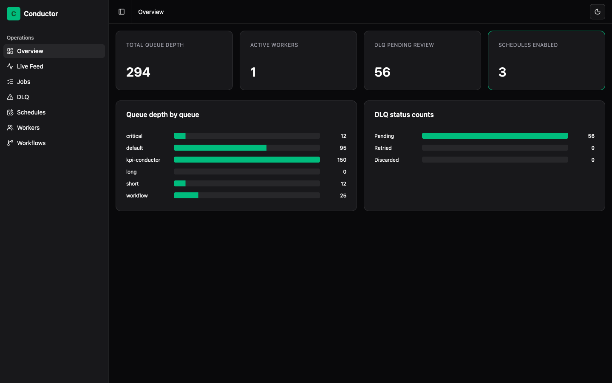
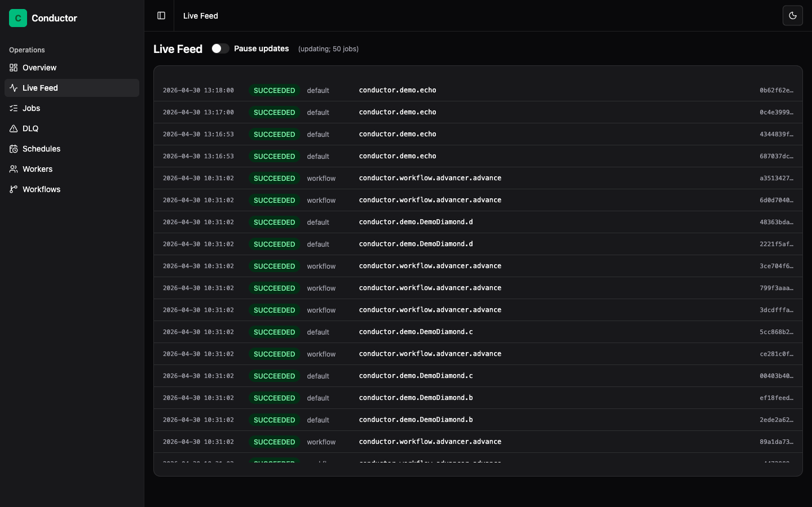
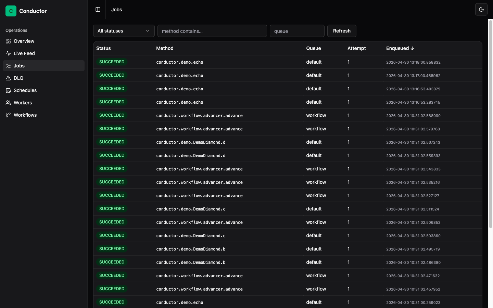
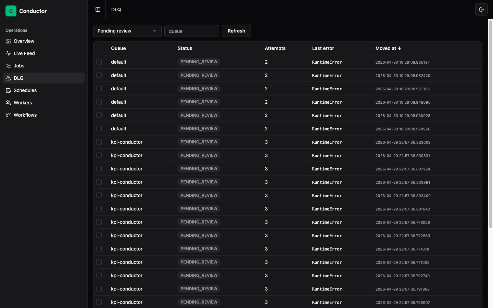
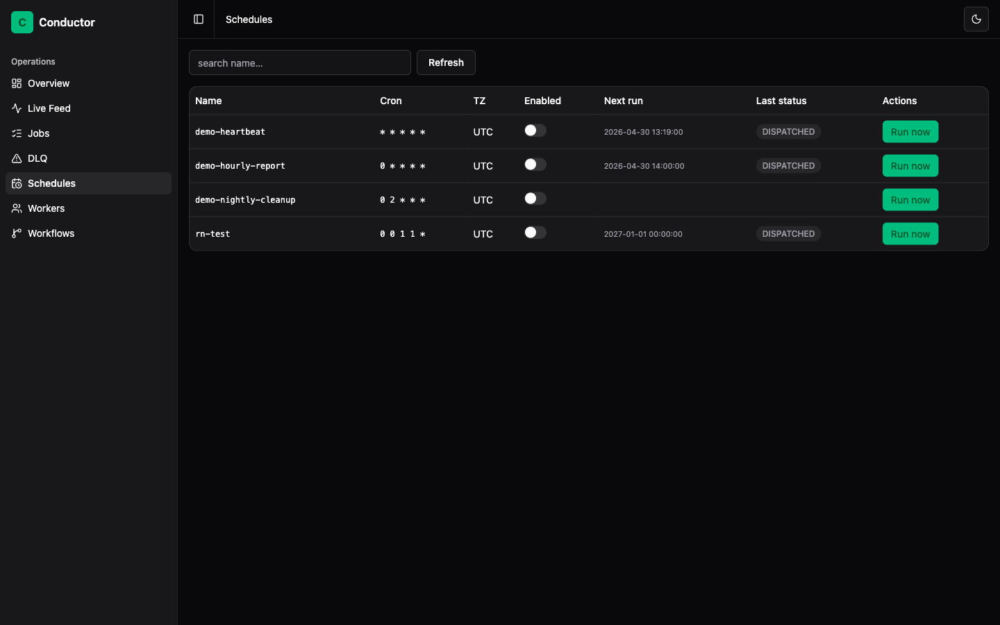
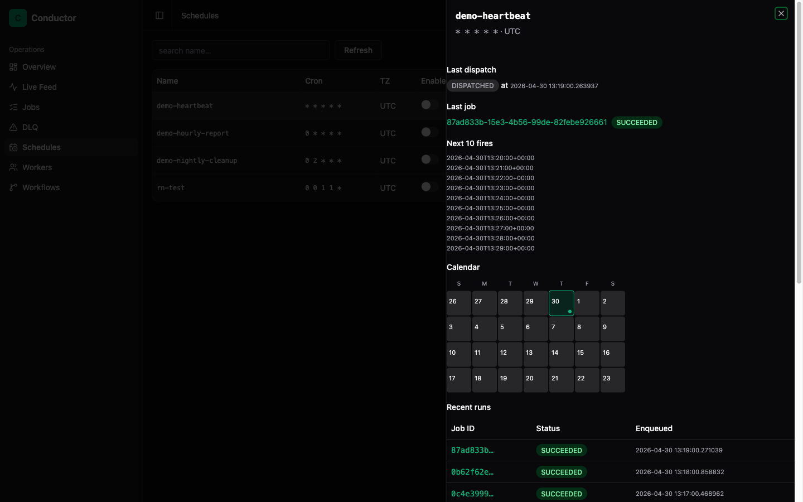
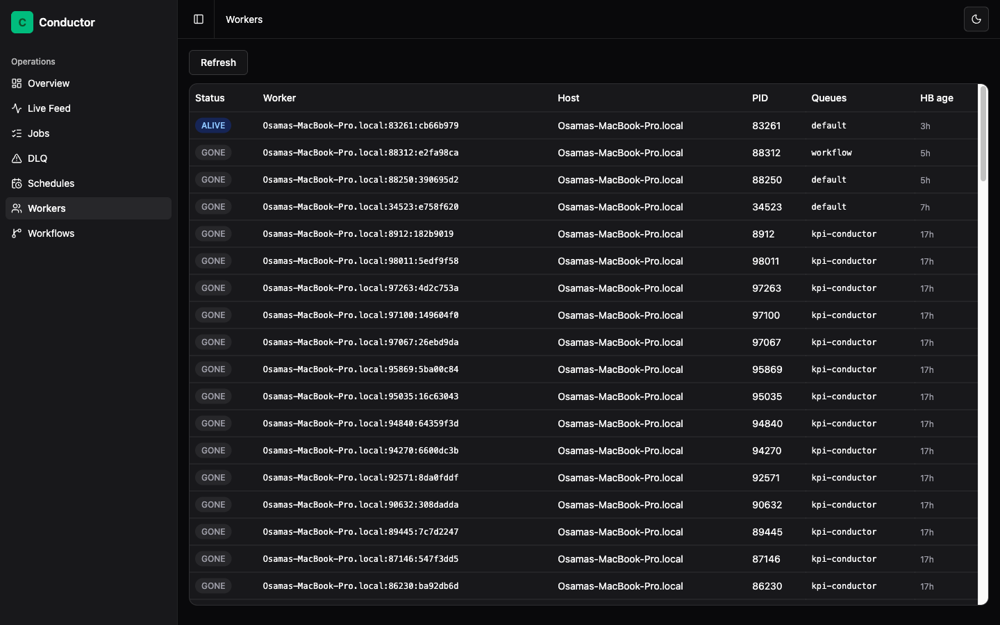
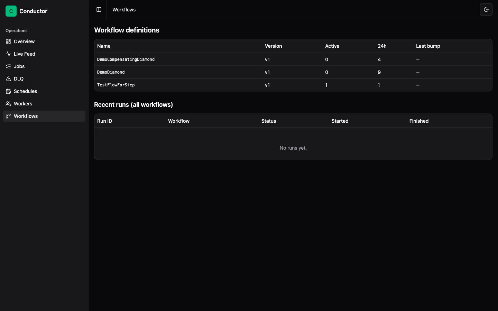

# Conductor

A reliability-first background job platform for Frappe / ERPNext.

Conductor coexists with Frappe RQ on the same Redis instance and gives you durable at-least-once execution, declarative retries, idempotent dispatch, scheduled jobs, DAG workflows with compensations, and a real-time operations dashboard — without rewriting your existing `frappe.enqueue` callsites.


## Features

- **Durable streams.** Jobs ride Redis Streams with consumer groups, so a killed worker is reclaimed by its peers, not lost.
- **Declarative retries.** `RetryPolicy(max_attempts, backoff, jitter, retry_on, no_retry_on)` decided once at dispatch, pinned across redeploys.
- **Dispatch idempotency.** A single `idempotency_key` collapses duplicate producers to one job.
- **Per-attempt audit.** Every attempt writes a `Conductor Job Run` row with timestamps, traceback, and the worker that ran it — queryable from Desk.
- **Dead-letter queue.** Exhausted jobs land in `Conductor DLQ Entry` rows; bulk-retry from the dashboard or `bench conductor dlq retry`.
- **Cron schedules.** A leader-elected scheduler runs `Conductor Schedule` rows with sub-second drift; fail-over takes ~30 s.
- **DAG workflows.** `@conductor.workflow` + `Step.depends_on` with atomic fan-in and reverse-topological compensations on terminal failure.
- **Multi-tenant pool mode.** One worker process serves N sites (`--sites=auto` or `--sites=A,B,C`) with per-tenant rate limits and concurrency caps.
- **Real-time dashboard.** Vue 3 SPA at `/conductor-dashboard` with live overview, job timeline, DLQ browser, schedules, workers, and workflow visualization.
- **Drop-in `frappe.enqueue`.** Opt-in shim lets one app migrate while the rest of the bench keeps running on RQ.

Measured against Frappe RQ on the same site, same workload, Conductor delivers ~4× the throughput, 50× fewer duplicate executions, and 4× more audit detail per retry. Full KPI table at [`docs/explanation-why-conductor.md`](docs/explanation-why-conductor.md).

## Screenshots

The dashboard ships a sidebar shell with a `light` / `dark` / `system` toggle. Captures below are dark mode against a real running site.

| | |
|---|---|
|  |  |
| **Overview** — queue depths, worker count, DLQ pending, schedule count | **Live Feed** — streaming job activity with pause toggle |
|  |  |
| **Jobs** — Tanstack data table with sortable columns + pagination + status filter | **DLQ** — multi-select rows for bulk retry / discard / edit-and-retry |
|  |  |
| **Schedules** — cron list with inline enable / disable + Run-now | **Schedule detail** — right-side Sheet with last dispatch, next 10 fires, calendar, recent runs |
|  |  |
| **Workers** — heartbeat-sorted with hover-tooltip for exact ISO timestamps | **Workflows** — definitions table + recent runs (click a row to filter) |

## Requirements

- Frappe 15.x (developed against 15.106.0)
- Python 3.10+
- Redis 5+ (the bench's existing `redis_queue` instance is fine)

## Installation

```bash
# from your bench root
bench get-app https://github.com/osama1998H/conductor
bench --site <site> install-app conductor
```

Append the worker and scheduler to your bench `Procfile`:

```
conductor_worker: bench --site <site> conductor worker --queue default --concurrency 4
conductor_scheduler: bench --site <site> conductor scheduler
```

Then start the bench and verify end-to-end:

```bash
bench start
bench --site <site> conductor doctor --demo
```

## Usage

```python
import conductor

# Drop-in dispatch
job_id = conductor.enqueue("myapp.tasks.send_invoice_email", invoice="INV-001")

# Declarative retry policy on a callable
@conductor.job(
    queue="critical",
    max_attempts=5,
    retry_on=(ConnectionError,),
    no_retry_on=(ValueError,),
)
def charge_card(customer, amount):
    ...

conductor.enqueue("myapp.billing.charge_card", customer="C1", amount=99)

# Idempotent dispatch — duplicate producers collapse to one job
conductor.enqueue(
    "myapp.tasks.send_invoice_email",
    invoice="INV-001",
    idempotency_key="invoice:INV-001:email",
)

# Cancel a running job (cooperative)
conductor.cancel(job_id)
```

DAG workflows:

```python
from conductor.workflow import Step, workflow, run_workflow

@workflow(name="OnboardCustomer", queue="default")
class OnboardCustomer:
    create = Step("create")
    notify = Step("notify", depends_on=("create",), compensation="rollback_create")
    bill   = Step("bill",   depends_on=("create",))

    def create(self, customer): ...
    def notify(self, customer): ...
    def bill(self, customer): ...
    def rollback_create(self, customer): ...

run_id = run_workflow("OnboardCustomer", customer="C1")
```

CLI:

```bash
bench --site <site> conductor worker --queue default --concurrency 4
bench --site <site> conductor scheduler
bench --site <site> conductor schedule list
bench --site <site> conductor dlq retry --queue critical --limit 100
bench --site <site> conductor depth
bench --site <site> conductor doctor [--demo]
```

## Configuration

Set in `sites/<site>/site_config.json` under the `conductor` key (all optional):

| Key | Default | Notes |
|---|---|---|
| `conductor.redis_url` | bench `redis_queue` host, DB 2 | Coexists with stock RQ on the same Redis. |
| `conductor.default_queue` | `default` | Used when `queue` kwarg omitted. |
| `conductor.idem_ttl_seconds` | `86400` | Idempotency-lock TTL. |
| `conductor.exec_lock_ttl_seconds` | `600` | Per-job execution-lock TTL. |
| `conductor.stream_maxlen` | `10000` | Approximate `XADD … MAXLEN ~` per queue. |
| `conductor.heartbeat_seconds` | `5` | Worker heartbeat cadence. |

Per-queue defaults (max_attempts, backoff, base/max delay, jitter, max_rps, max_concurrent) are stored on `Conductor Queue` rows and editable from Desk. Full reference at [`docs/reference-configuration.md`](docs/reference-configuration.md).

## Project structure

```
conductor/      Python package (Frappe app)
  api/          Whitelisted endpoints consumed by the dashboard
  commands/     bench conductor <subcommand> entrypoints
  workflow/     DAG runner (decorator, advancer, compensation, snapshot)
  patches/      One-shot migrations
  www/          /conductor-dashboard route shell
dashboard/      Vue 3 + Vite + Tailwind SPA
docs/           Diátaxis user docs (tutorial / how-to / reference / explanation)
tests/          Unit + integration suite
tests_chaos/    Subprocess-spawning chaos suite (kill -9, reclaim, etc.)
```

## Contributing

```bash
cd apps/conductor
pre-commit install
/Users/<you>/frappe-bench/env/bin/pytest tests
```

Behavior changes ship with a docs update under `docs/` in the same commit.

## Roadmap

What landed in v1: [`docs/roadmap/v1.md`](docs/roadmap/v1.md).

## License

MIT — see [`license.txt`](license.txt).

## Support

- Documentation: [`docs/index.md`](docs/index.md)
- Issues / questions: <https://github.com/osama1998H/conductor/issues>
