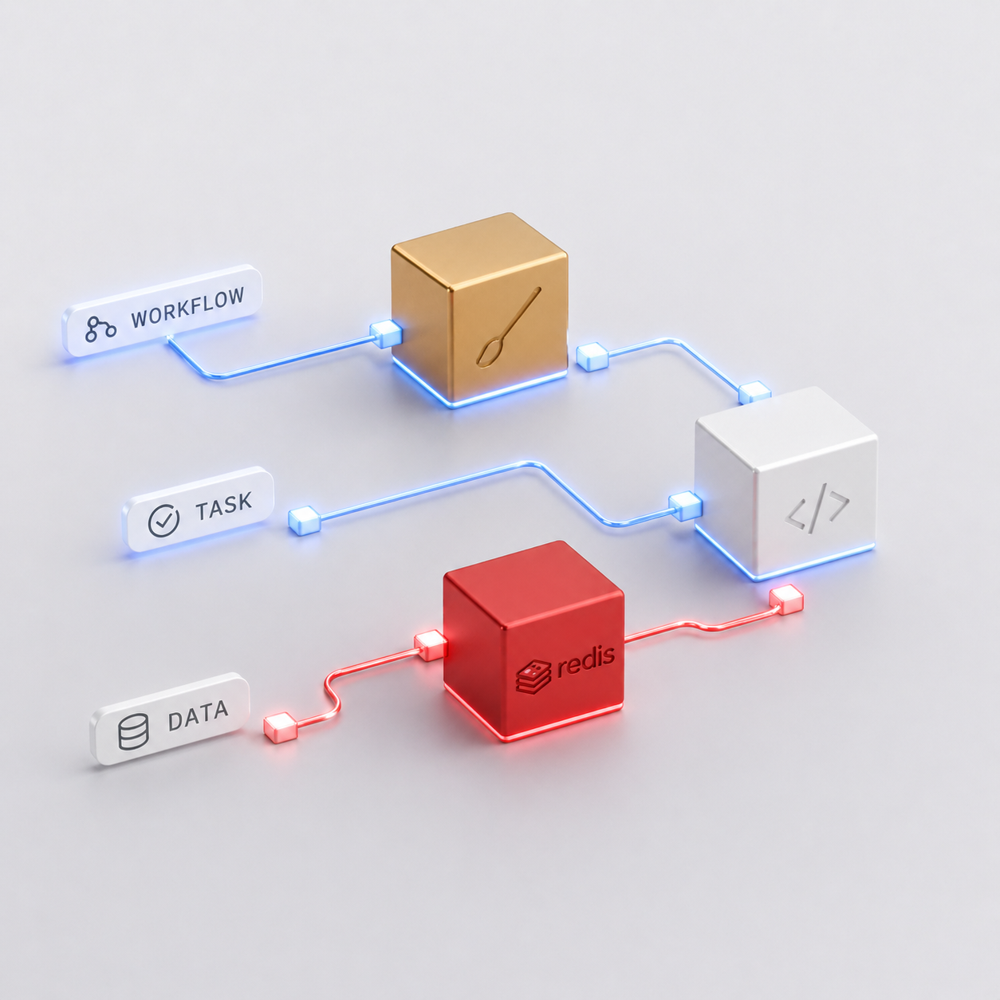

# Conductor

Reliability-first background job platform for Frappe / ERPNext.




Phase 0 ships the skeleton: dispatcher, worker, doctor, and the three core
DocTypes (`Conductor Queue`, `Conductor Job`, `Conductor Worker`). No retries,
no DLQ, no scheduler — those land in Phase 1+.

## Install

```bash
cd <bench>
bench get-app conductor <repo-url>           # or copy the app into apps/
bench --site <site> install-app conductor
bench --site <site> conductor doctor --demo  # acceptance test
```

## Run a worker (foreground)

```bash
bench --site <site> conductor worker --queue default --concurrency 4
```

## Run a worker via `bench start`

`bench start` reads `Procfile` at the bench root. Append our line:

```bash
cat apps/conductor/Procfile.conductor >> Procfile
```

## Use it

```python
import conductor
job_id = conductor.enqueue("myapp.tasks.send_email", queue="default", invoice="INV-001")
```

Or opt the whole app in by overriding `frappe.enqueue` in a client app's
`hooks.py`:

```python
override_whitelisted_methods = {"frappe.enqueue": "conductor.frappe_compat.enqueue"}
```

## Health check

```bash
bench --site <site> conductor doctor          # 4 checks, exit 0/1
bench --site <site> conductor doctor --demo   # adds full dispatch round-trip
```

## Configuration

In `sites/<site>/site_config.json`:

```json
{
  "conductor": {
    "redis_url": "redis://127.0.0.1:11000/2",
    "default_queue": "default",
    "stream_max_len": 10000
  }
}
```

If `conductor.redis_url` is not set, Conductor falls back to `redis_queue`
with DB **2** forced.

## Status

Phase 6 of 6 — final phase of v1 (Phase 4 was Observability — removed;
Phase 5 (Workflows) shipped 2026-04-29; Phase 6 (Multi-tenant polish)
shipped 2026-04-29). See
`docs/superpowers/specs/2026-04-27-conductor-master-design.md` for the
full roadmap.

## Operations (Phase 2+)

Conductor has two long-lived processes per site:

- **`bench conductor worker`** — executes jobs from queue streams.
- **`bench conductor scheduler`** — singleton per site; owns the cron loop, retry-delay drain, dead-worker reap, and orphan sweep.

### Procfile

A typical bench Procfile entry alongside the existing services:

```
conductor_worker:    bench --site frappe.localhost conductor worker --queue default --concurrency 4
conductor_scheduler: bench --site frappe.localhost conductor scheduler
```

Multiple `conductor_scheduler` instances are safe — only one holds the lock; the others poll. If the lock holder dies, a peer takes over within ~20 s (master Phase 2 exit criterion).

### Schedule admin

```
$ bench --site SITE conductor schedule list
$ bench --site SITE conductor schedule enable <name>
$ bench --site SITE conductor schedule disable <name>
$ bench --site SITE conductor schedule run-now <name>
```

`run-now` fires the schedule's payload immediately via `conductor.enqueue` and updates `last_status` / `last_job` on the schedule row, but does **not** advance `last_run_at` — the cron cadence is unchanged.

### Schedules in the Desk

Create / edit schedules in **Conductor Schedule** under the Conductor module. Required fields: `cron_expression`, `timezone` (defaults to UTC), `method` (dotted path), `queue`. Validation runs the cron expression through `croniter` on save; bad expressions are rejected with a Frappe validation error.

Cron is at-least-once across scheduler crashes — if a scheduler dies between `conductor.enqueue(...)` and the `next_run_at` update, the next holder re-fires the schedule. Make your `method` idempotent if duplicate execution would corrupt state.

## Workflows (Phase 5)

Define DAG workflows as Python classes with declarative steps and optional compensations:

```python
import conductor
from conductor.workflow import workflow, Step

@workflow(name="OrderFulfillment", queue="default")
class OrderFulfillment:
    reserve_step = Step("reserve",  compensation="release")
    charge_step  = Step("charge",   depends_on=("reserve",), compensation="refund")
    notify_step  = Step("notify",   depends_on=("reserve",))
    receipt_step = Step("receipt",  depends_on=("charge", "notify"))

    def reserve(self, *, order_id): ...
    def release(self, *, order_id): ...
    def charge(self,  *, order_id): ...
    def refund(self,  *, order_id): ...
    def notify(self,  *, order_id): ...
    def receipt(self, *, order_id): ...
```

Trigger:

```python
run_id = conductor.run_workflow("OrderFulfillment", order_id=42, idempotency_key="ord-42")
```

Each step runs as a normal Conductor Job, inheriting Phase-1 retry/timeout/idempotency/DLQ. On a step's terminal failure, completed steps are compensated in reverse-topological order; the run lands `FAILED`. If a compensation itself terminally fails, earlier completed steps are **not** rolled back — operator triages from the dashboard.

CLI:

```
$ bench --site SITE conductor workflow list
$ bench --site SITE conductor workflow run <name> [--kwargs '{"k":"v"}'] [--idempotency-key K]
$ bench --site SITE conductor workflow status <run_id>
$ bench --site SITE conductor workflow cancel <run_id>
```

Dashboard tab: `/conductor-dashboard#/workflows` — Mermaid DAG visualization with per-step status colors, run history, cancel-run action (operator-gated).

## Multi-tenant deployments (Phase 6)

Conductor supports two worker shapes:

```bash
# Single-site (existing behavior — bench --site provides the site):
bench --site=alpha.tenant.example.com conductor worker --queue default --concurrency 4

# Pool mode — one process serves N sites:
bench conductor worker --sites=auto --queue default --concurrency 8
bench conductor worker --sites=alpha.test,beta.test --queue default --concurrency 8
```

`--sites=auto` walks `sites/<dir>/site_config.json` and keeps sites with `conductor` in `installed_apps`. The site list is resolved once at boot — onboarding a new tenant requires restarting the pool worker.

### Per-tenant rate limits and concurrency caps

Two new fields on each `Conductor Queue` row:

| Field | Default | Meaning |
|---|---|---|
| `max_rps` | `0` (unlimited) | Tokens per second, enforced by an atomic Redis Lua bucket on `conductor:{site}:rate:{queue}` |
| `max_concurrent` | `0` (unlimited) | Cap on simultaneously RUNNING jobs across the worker fleet, enforced on `conductor:{site}:inflight:{queue}` |

Throttled jobs are NOT failures — they land in `SCHEDULED_RETRY` with `last_error_message="rate_limited"` or `"inflight_capped"`, ride the existing Phase 2 delay loop, and rejoin the queue when capacity returns. The dashboard shows a count of throttled jobs alongside actual retries.

### Operational subcommands

```bash
# Per-(site, queue) depth snapshot:
bench --site=alpha.test conductor depth
bench conductor depth --all-sites

# DLQ triage:
bench --site=alpha.test conductor dlq list --queue default
bench --site=alpha.test conductor dlq retry --queue default --limit 50
bench --site=alpha.test conductor dlq discard --job <job_id>

# RQ → Conductor migration (idempotent via Redis marker):
bench --site=alpha.test conductor migrate-from-rq               # dry-run preview
bench --site=alpha.test conductor migrate-from-rq --commit      # actually move
bench --site=alpha.test conductor migrate-from-rq --commit --force  # ignore prior marker
```

## Dashboard (Phase 3)

The Conductor dashboard is at `https://<your-site>/conductor-dashboard`. Six tabs:

- **Overview** — number cards (queue depth, active workers, DLQ pending, schedules enabled) + horizontal bar charts.
- **Live Feed** — chronological stream of recent jobs; click a row to drill into job detail.
- **Jobs** — filterable list (queue, status, method); click → detail with status timeline, args/kwargs, traceback, and **Retry** / **Cancel** buttons.
- **DLQ** — failed-after-retries jobs; multi-select for bulk retry / discard / edit-and-retry.
- **Schedules** — list + run-now + enable/disable toggle + per-schedule mini calendar of upcoming fires.
- **Workers** — observability of worker fleet: status, heartbeat age, currently executing, recent jobs.

### Permissions

- **System Manager**: full access.
- **Conductor Operator**: read everything + retry / cancel / schedule run-now.
- Destructive actions (DLQ discard, payload edit-and-retry, schedule enable/disable) are System Manager only.

### Configuration

In `site_config.json`:

```json
{
  "conductor": {
    "dashboard_poll_interval_ms": 2000
  }
}
```

The dashboard polls `conductor.api.dashboard.get_state` for aggregates at this interval (default 2000 ms; configurable per site for high-volume installations). Per-job realtime events deliver into the open detail view via Frappe's socketio (`doc:Conductor Job/{job_id}` rooms).

### Build

The dashboard is a Vue 3 SPA under `apps/conductor/dashboard/`. Build with:

```bash
cd apps/conductor/dashboard && yarn install && yarn build
```

Outputs hashed JS/CSS bundles to `apps/conductor/conductor/public/dashboard/` and copies the entry HTML to `apps/conductor/conductor/www/conductor-dashboard.html`. After a fresh build, run `bench --site <site> clear-cache` so Frappe picks up the new entry HTML.

## Contributing

This app uses `pre-commit` for code formatting and linting. Please [install pre-commit](https://pre-commit.com/#installation) and enable it for this repository:

```bash
cd apps/conductor
pre-commit install
```

## License

MIT
