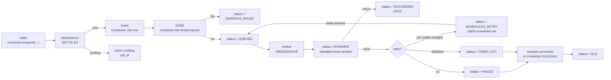

# Architecture

Conductor is a Redis-streams job queue with a single scheduler per site, N workers, and a Frappe-backed audit log. This page explains the moving parts and how a job moves through them.

The unit of isolation is the **site**. Every Redis key is namespaced `conductor:{site}:…`, and the `tabConductor *` MariaDB tables live inside each site's database. A pool worker can serve many sites, but a job never crosses the site boundary in either store.

---

## Components

- **Dispatcher** — `enqueue(...)` writes the `Conductor Job` row, then `XADD`s the encoded message to the stream. Reserves the idempotency slot first; if a prior job holds the slot, returns that job's id without enqueuing again.
- **Stream** — Redis Stream, one per `(site, queue)`. Producers `XADD`; workers `XREADGROUP` from the `conductor` consumer group. Trimmed to `conductor.stream_max_len` on each write (approximate, via `MAXLEN ~`).
- **Worker** — long-lived process. Pulls messages, runs each job in a thread-pool slot, manages per-attempt deadlines, writes status flips back to MariaDB, and `XACK`s on terminal outcomes. Heartbeats to Redis.
- **Scheduler** — singleton-per-site process. Holds a Redis lock with TTL; renews while alive. Runs the cron loop, the retry-delay drain, the dead-worker reaper, and the orphan sweeper.
- **Sweeper** — promotes terminally-failed jobs into `Conductor DLQ Entry` rows; runs as a scheduler loop.
- **Dashboard** — Vue 3 SPA backed by `conductor.api.dashboard`. Polls `get_state` for aggregates; per-job realtime updates flow through Frappe's socketio.

---

## Redis keyspace

Every key is prefixed `conductor:{site}:…` so multi-site benches share one Redis without collisions.

| Key | Purpose | Notes |
|---|---|---|
| `conductor:{site}:stream:{queue}` | Per-queue stream | Producers `XADD`, workers `XREADGROUP` (group `conductor`). |
| `conductor:{site}:dlq:{queue}` | Per-queue DLQ stream | A second stream the sweeper writes to before promoting to MariaDB. |
| `conductor:{site}:scheduled` | Sorted set of delayed messages | Score = `run_at_unix_ms`. The scheduler drains due members and re-`XADD`s them. |
| `conductor:{site}:idem:<sha256(key)>` | Per-job idempotency lock | `SET NX EX <ttl>`; value is the holding `job_id`. TTL = `conductor.idempotency_ttl_seconds`. |
| `conductor:{site}:wfidem:<sha256(key)>` | Per-workflow idempotency lock | Same shape, applied to `run_workflow(idempotency_key=...)`. |
| `conductor:{site}:rate:{queue}` | Per-queue token bucket | Lua-backed; enforces `Conductor Queue.max_rps`. |
| `conductor:{site}:inflight:{queue}` | Per-queue inflight counter | Lua-backed; enforces `Conductor Queue.max_concurrent`. |
| `conductor:{site}:scheduler:lock` | Singleton lock | `SET NX EX 15`; only the holder advances the cron loop. |
| `conductor:{site}:workers` | Worker registry | Heartbeats; the reaper marks stale workers `GONE`. |
| `conductor:{site}:wfdeps:{run_id}` | Per-run step-dependency hash | Decremented atomically by Lua as predecessors finish. |
| `conductor:{site}:rq_migrated_at` | One-shot migration marker | Created by `migrate-from-rq --commit` to make re-runs idempotent. |

The `{site}` segment is read from the **stream key**, never from the message body. A pool worker that pulls `conductor:alpha:stream:default` initializes Frappe against `alpha` regardless of what the message claims.

---

## A job's life

The path from `enqueue` to `SUCCEEDED` is the green path; everything else is exception handling. Status writes go into `tabConductor Job`; per-attempt detail goes into `tabConductor Job Run`. Terminal `XACK` happens whether the outcome is success or failure — the stream message is removed from the consumer group's pending entries list either way.

---

## The scheduler singleton

Multiple `bench conductor scheduler` processes per site are safe. Only the lock holder runs the loops; others poll the lock at `--poll-interval-seconds` (default 5 s).

The lock uses three Lua-guarded operations on a single key:

- `SET NX EX 15` to acquire.
- `GET == self ? PEXPIRE 15s : 0` to renew (every 5 s by default).
- `GET == self ? DEL : 0` to release at clean shutdown.

If the holder dies, the lock TTL expires within 15 s. The next polling peer wins `SET NX EX` and takes over. The Phase-2 exit criterion targets failover under ~20 s.

The scheduler's loops are:

1. **Cron** — for each enabled `Conductor Schedule` whose `next_run_at` is past, call `conductor.enqueue(...)` and advance `next_run_at`. Cron fires are at-least-once across crashes.
2. **Retry-delay drain** — pop due members of `conductor:{site}:scheduled` and `XADD` them back to their target stream.
3. **Reaper** — mark heartbeat-expired workers `GONE`. Adjust the `inflight` counter to compensate for capped jobs the dead worker held.
4. **Sweeper** — for jobs whose retry budget is exhausted, write a `Conductor DLQ Entry` row, set the job status to `DLQ`, and `XACK` the stream entry.

---

## Pool worker model

A worker process can serve one site (`bench --site SITE conductor worker`) or many (`bench conductor worker --sites=auto` or a comma list). Pool mode does three things differently:

- **Site discovery** — `--sites=auto` walks `sites/<dir>/site_config.json` once at boot and keeps every site that has `conductor` in its `installed_apps`. Onboarding a new tenant requires restarting the pool worker; the discovery does not run again.
- **Per-stream routing** — the worker `XREADGROUP`s every site's streams. Each message's site is read from the stream key (`conductor:{site}:stream:{queue}`), not from the message body, then Frappe is initialized against that site for the duration of the job.
- **Per-tenant caps** — `max_rps` and `max_concurrent` are enforced per `(site, queue)` against `conductor:{site}:rate:{queue}` and `conductor:{site}:inflight:{queue}`. Caps are *per pool process*, not fleet-wide; cluster-wide caps would require a token broker that Conductor does not ship.

A throttled job is **not** a failure — it lands in `SCHEDULED_RETRY` with `last_error_message="rate_limited"` or `"inflight_capped"`, rides the retry-delay loop, and rejoins the queue when capacity returns.

---

## Process supervision in production

Conductor's reliability model assumes that workers can crash and the
remaining workers will reclaim their pending entries via `XAUTOCLAIM`
after the configured idle threshold (60s default). The reclaim path
is verified end-to-end by `tests_chaos/test_kill_during_run.py`.

Whether reclaim **actually happens in production** depends on the
process supervisor that runs your `bench conductor worker` instances.
If the supervisor cascades a single-worker crash into a full
fleet shutdown, the surviving workers are killed before the reclaim
window opens — and Conductor's correctness guarantee never gets a
chance to fire.

### Honcho (`bench start`) is not safe for multi-worker production

`bench start` invokes Honcho with the bench `Procfile`. Honcho's
default behavior is *cascade-on-exit*: any unexpected child process
exit triggers SIGTERM to every other process in the tree. The v2
certification campaign reproduced this on 2026-05-04 — a `kill -9`
on one of two `conductor_worker` entries took down Redis, the web
process, the socketio process, the second `conductor_worker`, and
the conductor scheduler. See `docs/roadmap/v2-certification/multi-worker.md`
for the captured cascade.

This is fine for development. It is **not** fine for a production
deployment that depends on Conductor's reclaim guarantee.

### Recommended supervisors for production

| Supervisor | Why it works | Trade-off |
|---|---|---|
| **systemd unit per worker** | Each worker has its own restart policy and unit boundary; one crash does not touch peers | Linux-only; needs root for unit-file installation |
| **supervisord with `autorestart=true`** | Same isolation as systemd, no root needed; auto-restart fills the gap left by the crashed worker without touching peers | Extra dependency; slightly more configuration than systemd |
| **Two separate Honcho processes** | Run bench infrastructure (Redis, web, socketio, schedule, scheduler) under one Honcho and each worker under its own Honcho. Cascade is contained to the per-worker Honcho — bench infra survives | More moving parts than a single `bench start`; needs a custom shell wrapper |
| **Frappe Cloud's supervisor** | Already isolates workers; would not exhibit the cascade observed on local Honcho | Requires Frappe Cloud (out of scope for self-hosted v2.0.0) |

### What this means for the v2 quickstart

The `Procfile.conductor` shipped with v2 is for **single-machine
development and the v2 certification campaign**. The v2.x release
notes will recommend systemd / supervisord for production multi-worker
deployments and link back to this section.

The Conductor reclaim mechanism itself is correct — verified by
`tests_chaos/test_kill_during_run.py`. This is purely guidance about
how to run Conductor's processes so the reclaim path can do its job.

---

## See also

- [`reference-configuration.md`](reference-configuration.md) — every `site_config` key and DocType field referenced above.
- [`explanation-reliability.md`](explanation-reliability.md) — what the at-least-once contract guarantees and what it does not.
- [`how-to-run-multi-tenant.md`](how-to-run-multi-tenant.md) — task-oriented walkthrough for the pool worker.
