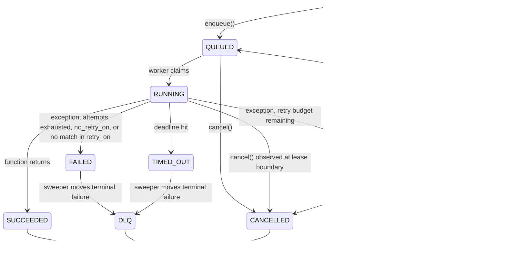

# Configuration reference

Reference for everything that controls Conductor's behavior on a site: `site_config.json` keys, DocType fields, role permissions, and the job state machine.

---

## `site_config.json` keys

All keys live under the `conductor` object in `sites/<site>/site_config.json`:

```json
{
  "conductor": {
    "redis_url": "redis://127.0.0.1:11000/2",
    "default_queue": "default",
    "stream_max_len": 10000,
    "idempotency_ttl_seconds": 86400,
    "wfidem_ttl_seconds": 86400,
    "dashboard_poll_interval_ms": 2000
  }
}
```

| Key | Type | Default | Meaning |
|---|---|---|---|
| `conductor.redis_url` | string | falls back to top-level `redis_queue` with DB forced to `2` | Redis URL for streams, idempotency, scheduling, and rate limits. Set this explicitly in production. |
| `conductor.default_queue` | string | `"default"` | Queue name used when `enqueue` is called without a `queue=` argument and the function has no `@conductor.job(queue=...)`. |
| `conductor.stream_max_len` | int | `10000` | Approximate `MAXLEN` cap passed to `XADD`. Older entries are trimmed once the stream exceeds this. |
| `conductor.idempotency_ttl_seconds` | int | `86400` (24 h) | TTL for the per-job idempotency lock in Redis. Two `enqueue` calls with the same `idempotency_key` within this window return the same `job_id`. |
| `conductor.wfidem_ttl_seconds` | int | `86400` (24 h) | TTL for the per-workflow idempotency lock. Same semantics as `idempotency_ttl_seconds` but for `run_workflow`. |
| `conductor.dashboard_poll_interval_ms` | int | `2000` | How often the dashboard polls `conductor.api.dashboard.get_state` for aggregates. |

---

## DocType fields

Frappe-default fields (`name`, `creation`, `modified`, `owner`, `docstatus`) are omitted. The leading flag column shows: `!` = required, `r` = read-only, `u` = unique.

### Conductor Queue

Persistent definition of a queue, including default retry/timeout policy and per-tenant caps.

| Flags | Field | Type | Notes |
|---|---|---|---|
| `! u` | `queue_name` | Data | Must be unique across the site. |
| | `enabled` | Check | A disabled queue rejects enqueues. |
| | `concurrency` | Int | Hint for default worker concurrency. |
| | `default_max_attempts` | Int | Default retry cap. |
| | `default_timeout` | Int | Default per-job timeout, seconds. |
| | `default_backoff` | Select | One of `exponential`, `linear`, `fixed`. |
| | `default_base_delay_seconds` | Int | Backoff base. |
| | `default_max_delay_seconds` | Int | Backoff cap. |
| | `default_jitter` | Select | One of `none`, `full`, `equal`. |
| | `max_rps` | Int | Token bucket cap. `0` = unlimited. |
| | `max_concurrent` | Int | Inflight cap. `0` = unlimited. |
| | `description` | Small Text | Free-form. |

### Conductor Job

One row per dispatched job. Field-level append-only — every status flip writes here.

| Flags | Field | Type | Notes |
|---|---|---|---|
| `! u` | `job_id` | Data | UUID. |
| `!` | `queue` | Link | Conductor Queue. |
| `!` | `method` | Data | Dotted path. |
| `!` | `status` | Select | See [job state machine](#job-state-machine). |
| | `site` | Data | Multi-tenant tag. |
| | `args`, `kwargs` | Long Text | Base64-encoded msgpack. |
| `r` | `args_preview`, `kwargs_preview` | Code | Truncated JSON for the dashboard. |
| | `attempt` | Int | Current attempt (1-indexed). |
| | `max_attempts` | Int | Cap from `RetryPolicy`. |
| | `timeout_seconds` | Int | Effective per-attempt timeout. |
| | `enqueued_at`, `scheduled_at`, `started_at`, `finished_at`, `next_run_at`, `deadline` | Datetime | Lifecycle timestamps. |
| | `idempotency_key` | Data | The dedup key, if any. |
| | `workflow_run_id`, `step_id` | Data | Set when the job belongs to a workflow. |
| | `last_error_type`, `last_error_message`, `last_traceback` | Data / Small Text / Long Text | Latest failure metadata. |
| `r` | `result_preview` | Code | Truncated JSON return value. |
| | `worker_id`, `redis_msg_id` | Data | Bookkeeping. |

### Conductor Job Run

One row per **attempt**. Lets the audit show retries individually.

| Flags | Field | Type | Notes |
|---|---|---|---|
| `!` | `job` | Link | Conductor Job. |
| `!` | `attempt_number` | Int | 1-indexed. |
| `!` | `status` | Select | One of `SUCCEEDED`, `FAILED`, `TIMED_OUT`, `CANCELLED`. |
| | `worker_id` | Data | |
| | `started_at`, `finished_at` | Datetime | |
| | `duration_ms` | Int | |
| | `error_type`, `error_message`, `traceback` | Data / Small Text / Long Text | Per-attempt failure metadata. |

### Conductor Worker

One row per known worker process; updated on heartbeat.

| Flags | Field | Type | Notes |
|---|---|---|---|
| `! u` | `worker_id` | Data | Stable identifier. |
| | `host`, `pid` | Data / Int | |
| | `queues` | Long Text | JSON-encoded list. |
| | `site` | Data | Site this worker is currently bound to (rotates in pool mode). |
| | `status` | Select | One of `ALIVE`, `STALE`, `GONE`. |
| | `started_at`, `last_heartbeat` | Datetime | |
| | `current_job` | Link | Conductor Job currently executing. |
| | `conductor_version` | Data | |

### Conductor Schedule

A cron-driven enqueue trigger.

| Flags | Field | Type | Notes |
|---|---|---|---|
| `! u` | `schedule_name` | Data | |
| | `enabled` | Check | |
| `!` | `cron_expression` | Data | Validated against `croniter` on save. |
| | `timezone` | Data | Defaults to UTC. |
| `!` | `method` | Data | Dotted path. |
| `!` | `queue` | Link | Conductor Queue. |
| | `max_attempts` | Int | Override for the dispatched job. |
| | `args`, `kwargs` | Long Text | Base64 msgpack. |
| `r` | `last_run_at`, `last_status`, `last_job` | Datetime / Select / Link | Set after each fire. `last_status` is one of `""`, `DISPATCHED`, `DISPATCH_FAILED`. |
| `r` | `next_run_at` | Datetime | Computed from cron. |
| | `description` | Small Text | |

### Conductor Workflow

The persistent registry row for a `@workflow` class.

| Flags | Field | Type | Notes |
|---|---|---|---|
| `! u` | `workflow_name` | Data | |
| | `enabled` | Check | |
| | `definition_path` | Data | Dotted path to the class. |
| `r` | `version` | Int | Bumped automatically when the topology hash changes. |
| `r` | `definition_snapshot` | Long Text | Last seen DAG topology. |
| `r` | `last_version_bumped_at` | Datetime | |
| | `description` | Small Text | |

### Conductor Workflow Run

One row per `run_workflow(...)` invocation.

| Flags | Field | Type | Notes |
|---|---|---|---|
| `!` | `workflow` | Link | Conductor Workflow. |
| `!` | `definition_version` | Int | The version pinned to this run. |
| `!` | `status` | Select | One of `PENDING`, `RUNNING`, `COMPENSATING`, `SUCCEEDED`, `FAILED`, `CANCELLED`. |
| | `site` | Data | |
| | `input_args`, `input_kwargs` | Long Text | Base64 msgpack of the run inputs. |
| | `started_at`, `finished_at` | Datetime | |
| | `idempotency_key` | Data | |
| | `cancelled_at`, `cancelled_by` | Datetime / Link | Filled by `cancel_workflow_run`. |
| | `last_error` | Long Text | Failure context for the run. |

### Conductor Workflow Step Run

One row per **step attempt** inside a run, including compensations.

| Flags | Field | Type | Notes |
|---|---|---|---|
| `!` | `workflow_run` | Link | Conductor Workflow Run. |
| `!` | `step_id` | Data | The step name. |
| | `is_compensation` | Check | `1` for compensation rows, `0` for forward steps. |
| `!` | `status` | Select | One of `PENDING`, `READY`, `RUNNING`, `SUCCEEDED`, `FAILED`, `COMPENSATED`, `SKIPPED`. |
| | `depends_on` | Long Text | JSON-encoded predecessor list. |
| | `started_at`, `finished_at` | Datetime | |
| | `job` | Link | The Conductor Job that ran this step. |
| | `error_type`, `error_message` | Data / Small Text | |

### Conductor DLQ Entry

One row per job that has terminally failed and been moved to the DLQ.

| Flags | Field | Type | Notes |
|---|---|---|---|
| `!` | `job` | Link | Conductor Job. |
| | `queue` | Link | Conductor Queue. |
| | `moved_at` | Datetime | When the sweeper moved the job here. |
| | `attempts` | Int | Total attempts before moving. |
| `!` | `status` | Select | One of `PENDING_REVIEW`, `RETRIED`, `DISCARDED`. |
| | `last_error_type`, `last_error_message`, `last_traceback` | Data / Small Text / Long Text | Failure metadata. |
| | `payload` | Long Text | Stream payload (used by edit-and-retry). |
| | `reviewed_by`, `reviewed_at` | Link / Datetime | Who acted on the entry and when. |
| | `review_notes` | Small Text | Free-form. |

---

## Roles and permissions

Conductor ships two roles plus a default Frappe role:

- **System Manager** — full access. May discard DLQ entries, edit-and-retry payloads, enable/disable schedules.
- **Conductor Operator** — read everything, plus reversible actions (retry a job, cancel a job, retry a DLQ entry, run a schedule now).
- All other authenticated roles — no access by default.

The split reflects a destructive vs reversible distinction. Anything that loses data or changes scheduling cadence requires System Manager.

| Action | System Manager | Conductor Operator |
|---|---|---|
| Read every DocType | ✅ | ✅ |
| `retry_job` (re-enqueue any failed job) | ✅ | ✅ |
| `cancel_job` (soft-cancel) | ✅ | ✅ |
| `dlq_retry` (re-enqueue DLQ entries) | ✅ | ✅ |
| `schedule_run_now` (fire schedule out-of-band) | ✅ | ✅ |
| `cancel_workflow_run` | ✅ | ✅ |
| `dlq_discard` | ✅ | ❌ |
| `dlq_edit_and_retry` (modify payload before re-running) | ✅ | ❌ |
| `schedule_set_enabled` (enable / disable a schedule) | ✅ | ❌ |
| Edit DocType rows directly in the Desk | ✅ | ❌ (read-only) |

The dashboard mirrors these gates: actions a role cannot perform are hidden in the UI. CLI subcommands run as the bench's site user and inherit that user's roles.

---

## Job state machine



Terminal statuses are `SUCCEEDED`, `DLQ`, `CANCELLED`, and `DISPATCH_FAILED`. `FAILED` and `TIMED_OUT` are visible end-states for one attempt; the sweeper promotes them into `DLQ` on the next pass once retries are exhausted.

`SCHEDULED_RETRY` is **not a failure**. Throttled jobs (over `max_rps` or `max_concurrent`) also land here with `last_error_message` set to `"rate_limited"` or `"inflight_capped"`.

---

## See also

- [`reference-cli.md`](reference-cli.md) — CLI for the actions whose permissions are listed here.
- [`reference-python-api.md`](reference-python-api.md) — programmatic equivalents.
- [`explanation-reliability.md`](explanation-reliability.md) — what the state machine guarantees and what it does not.
